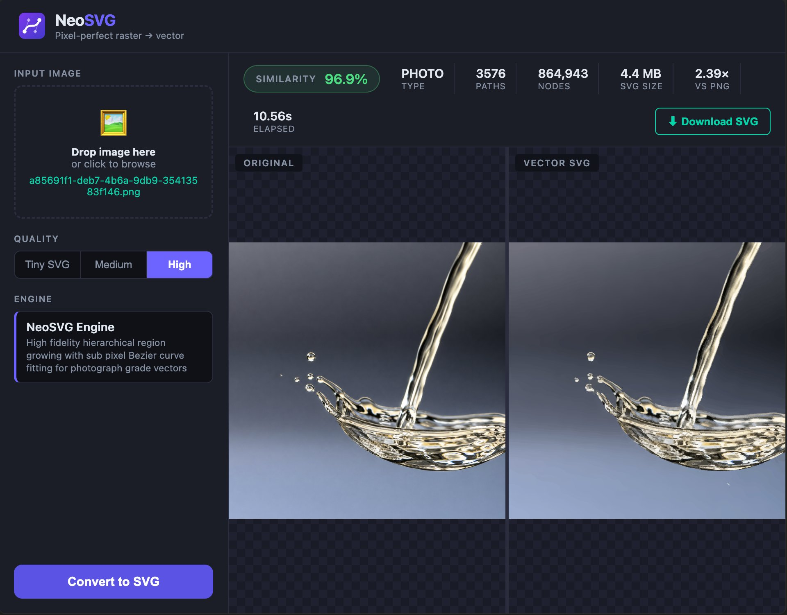

# NeoSVG

**AI-assisted raster-to-vector pipeline.** NeoSVG converts PNG/JPG images into
clean, photograph-grade SVG vectors using a multi-stage intelligence layer and
an original high-fidelity tracing engine.



The **NeoSVG Engine** performs hierarchical, local-colour region growing with
sub-pixel marching-squares contour extraction and Bézier curve fitting. It is
written from scratch — it does **not** depend on or derive from any
copyleft-licensed vectorization library — so the whole project ships under the
permissive MIT license and is free to use commercially.

---

## Features

- **Photograph-grade tracing** — sub-pixel contours + adaptive Bézier fitting
  for smooth gradients and crisp edges.
- **Output size == input size** — the SVG always matches the input image's
  pixel dimensions.
- **Transparency preserved end-to-end** — alpha is hard-masked and carried
  through to the SVG.
- **Smart pre-analysis** — automatic image-type classification (logo, photo,
  cartoon, line-art, pixel-art, icon) selects sensible defaults.
- **Optional stages** — OCR text preservation (PaddleOCR) and
  foreground/background segmentation (rembg), each degrading gracefully if the
  optional dependency is missing.
- **Three interfaces** — command line, batch processor, and a web UI.

## How it works

```
input.png
   │
   ▼
classify → preprocess → detect text → detect gradients → segment
   → vectorize (NeoSVG Engine) → detect primitives → simplify paths
   → assemble SVG → validate quality
   │
   ▼
output.svg
```

Three detail levels (`low`, `medium`, `high`,) trade path count against
fidelity; `high` is the default and is tuned for smooth gradients without
scratch artifacts.

## Installation

Requires **Python 3.9+**.

```bash
git clone <your-repo-url> neosvg
cd neosvg
pip install -r requirements.txt
```

The quality validator uses `cairosvg`, which needs the native **Cairo**
library. If Cairo isn't present the pipeline still produces valid SVG — only
the SSIM quality score is reported as `n/a`.

- macOS: `brew install cairo`
- Debian/Ubuntu: `sudo apt-get install libcairo2`

`paddleocr`/`paddlepaddle` (OCR) and `rembg` (segmentation) are optional; the
pipeline runs without them.

## Usage

### Command line

```bash
python main.py input.png output.svg
python main.py photo.jpg photo.svg --detail ultra
python main.py logo.png logo.svg --mode logo --quality best
```

Key options:

| Option        | Values                              | Default    | Purpose                                  |
|---------------|-------------------------------------|------------|------------------------------------------|
| `--mode`      | `auto` `logo` `photo` `cartoon`     | `auto`     | Force image type or auto-detect.         |
| `--quality`   | `fast` `balanced` `best`            | `balanced` | Skip heavy stages vs. run everything.    |
| `--detail`    | `low` `medium` `high` `ultra`       | `high`     | Vector fidelity (paths vs. accuracy).    |
| `--no-text`   | flag                                | off        | Skip OCR text detection.                 |
| `--primitives`| flag                                | off        | Replace shapes with circles/rects.       |
| `--gradients` | flag                                | off        | Emit SVG gradient fills.                 |
| `--verbose`   | flag                                | off        | Debug logging.                           |

### Web interface

```bash
python server.py            # serves on http://localhost:5000
PORT=8080 python server.py  # custom port
```

Open the URL, drop in an image, and download the resulting SVG.

### Batch processing

```bash
python batch.py ./input_folder/ ./output_folder/ --workers 4
```

Converts every supported image in a folder using a process pool and writes a
`report.csv` summary (SSIM, path/node counts, timing).

### Python API

```python
from main import run_pipeline

ctx = run_pipeline("input.png", "output.svg", detail="high")
print(ctx.path_count, ctx.node_count, ctx.ssim)
```

## Project layout

```
config.py        All tunable thresholds (no magic numbers elsewhere)
context.py       Context dataclass passed between stages
main.py          CLI entry point + run_pipeline orchestrator
server.py        Flask web server
batch.py         Multiprocessing batch converter
validator.py     Rasterise-back SSIM / size quality report
engines/
  hierarchical_grow_vectorizer.py   The NeoSVG Engine
  path_fitting.py                   Bézier fitting + SVG serialisation
  subpixel_contours.py              Sub-pixel marching-squares contours
  preprocessing.py                  Alpha flattening + edge boost
  visvalingam.py                    Visvalingam-Whyatt path simplifier
stages/          Pipeline stages (classify, preprocess, segment, …)
static/          Web UI
```

## License

Released under the **MIT License**  You may use,
modify, and distribute this software, including in commercial and closed-source
products, provided the copyright notice and license text are retained.

Copyright (c) 2026 neosvg.

## Credits

The NeoSVG Engine and pipeline are original work. NeoSVG builds on these
open-source libraries:

- [OpenCV](https://opencv.org/) — image processing (Apache-2.0)
- [NumPy](https://numpy.org/) — numerical arrays (BSD)
- [Pillow](https://python-pillow.org/) — image I/O (HPND/MIT-style)
- [scikit-image](https://scikit-image.org/) — marching-squares contours (BSD)
- [CairoSVG](https://cairosvg.org/) — SVG rasterisation for validation (LGPL)
- [Click](https://click.palletsprojects.com/) — CLI framework (BSD)
- [Rich](https://github.com/Textualize/rich) — terminal formatting (MIT)
- [Flask](https://flask.palletsprojects.com/) — web server (BSD)
- [PaddleOCR](https://github.com/PaddlePaddle/PaddleOCR) — optional OCR (Apache-2.0)
- [rembg](https://github.com/danielgatis/rembg) — optional segmentation (MIT)

Each dependency remains under its own license.
